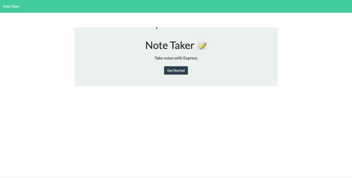

# note-taker

## Description 
This app allows the user to write notes so they can have easy access to information they write down later. The Notes can be entered through a simple, easy to use ui and are saved in a JSON file on a central server so they are persistent through page reloads and accesabile from any device. The app allows users to create as many new notes as they like and to delete notes when they don't need them anymore.

## Technologies
This app uses html and css to style the front end and the node.js express server to serve the page on the backend.

## Questions
If you have any questions about the app please feel free to contact me at mspringberry＠gmail.com